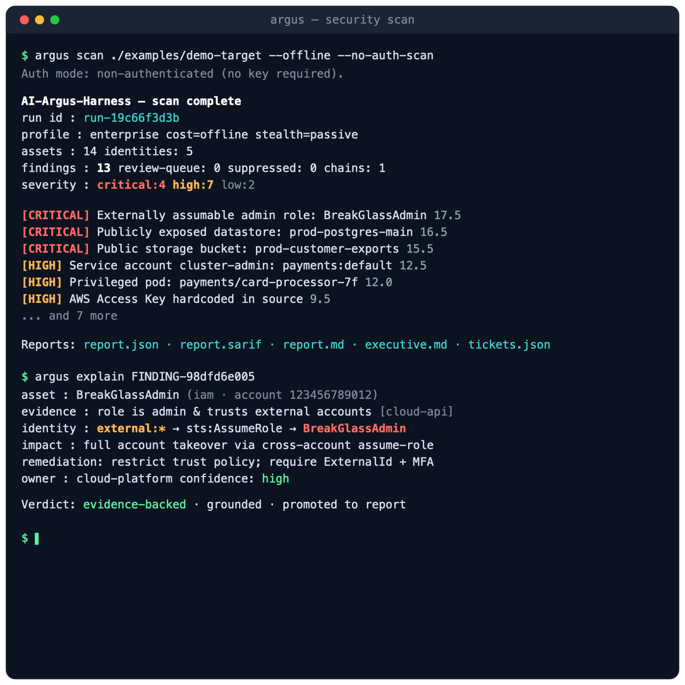
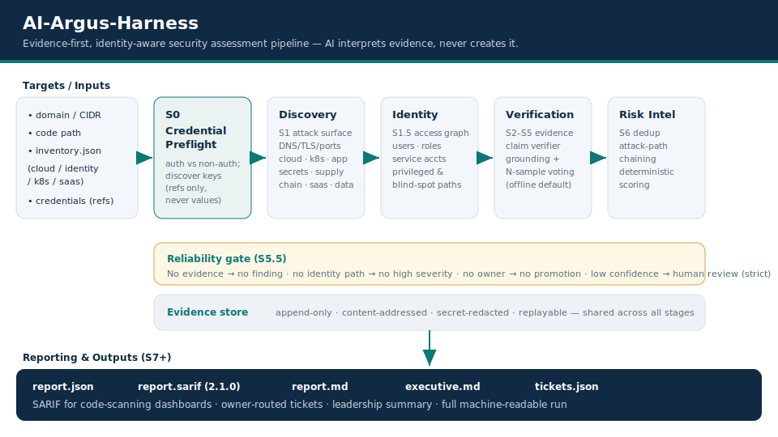

# AI-Argus-Harness

[](https://github.com/sam00/AI-Argus-Harness/actions/workflows/ci.yml)
[](https://github.com/sam00/AI-Argus-Harness/actions/workflows/codeql.yml)
[](https://securityscorecards.dev/viewer/?uri=github.com/sam00/AI-Argus-Harness)
[](LICENSE)
[](pyproject.toml)

> **Evidence-first, identity-aware security assessment harness.** It maps attack
> surface, builds an identity/access graph, finds privilege-escalation and
> attack-path chains to sensitive data, and emits reproducible, SARIF-ready
> findings — for offensive (recon / attack-path) **and** defensive workflows.

> **Core principle: AI is an evidence _interpreter_, never an evidence _creator_.**
> Deterministic scanners produce structured evidence; AI only reasons over it.
> The default provider is **offline** — zero external calls, no telemetry.

<p align="center">
  
</p>

**Coverage — 12 layers:** Domain · Network · AWS · GCP · Kubernetes ·
**Endpoint (Windows/macOS/Linux)** · Application/API · SaaS/IdP · Supply chain ·
CI/CD · Secrets · Data exposure. Full per‑capability status →
[`docs/coverage.md`](docs/coverage.md) · [Coverage section ↓](#coverage).

## Why this exists

Most scanners drown you in disconnected, low-context findings — and "AI security"
tools often hallucinate issues that don't exist. AI-Argus-Harness takes the
opposite stance:

- **Evidence or it didn't happen.** Every finding must carry source-bound
  evidence; AI may summarize/correlate but can never invent a finding.
- **Identity is the attack path.** Exposure only matters when a principal can
  reach it. The harness models identity as a first-class graph and chains
  findings into real attack paths.
- **Reproducible.** Same inputs → same `finding_id`, score, and severity. Runs
  are replayable and audit-ready.
- **Safe and offline by default.** Read-only posture, secret redaction, no
  network calls unless you ask for them.

Every finding must be complete before it is promoted:

```
asset + evidence + identity_path + impact + confidence + remediation + owner
```

Findings that fail this gate are routed to human review (or dropped in strict mode).

## Who should use it

| You are a... | You get... |
| --- | --- |
| **Red teamer / pentester** (authorized) | Fast recon, identity attack-path mapping, and chained privilege-escalation paths to sensitive data. |
| **Blue team / detection engineer** | Evidence-backed findings, detection-gap signals, and SARIF for your dashboards. |
| **Cloud / AppSec engineer** | Deterministic policy checks over AWS/GCP/Kubernetes/SaaS inventory + code (secrets, supply chain, CI/CD). |
| **Platform / SRE / GRC** | Reproducible, owner-routed, audit-ready reports and ticket export. |

## What it finds / tests

Across external surface, cloud, identity, Kubernetes, applications/APIs, SaaS,
and the software supply chain:

- **Identity attack paths** — externally assumable admin roles, over-privileged
  service accounts, over-scoped OAuth apps, privileged/blind-spot access.
- **Public exposure** — internet-reachable datastores and storage buckets.
- **Kubernetes** — `cluster-admin` bindings, privileged pods, risky RBAC.
- **Secrets** — hardcoded credentials in source (entropy + placeholder filtered).
- **Supply chain** — typosquatted and unpinned dependencies.
- **Endpoints** — missing/unhealthy EDR, unencrypted disks, stale patches, risky
  listening services on **Windows/macOS/Linux** hosts.
- **Attack-path chains** — links findings into end-to-end escalation narratives.

Twelve deterministic scanners: `domain`, `network`, `secrets`, `supply_chain`,
`aws`, `gcp`, `kubernetes`, `saas`, `cicd`, `data_exposure`, `application`,
`endpoint`.

## Coverage

**Runs on Linux, macOS, and Windows** — the core is pure Python **3.9+** with a
standard-library-only core (no compiled or OS-specific dependencies), so it
behaves identically on every platform and works fully **air-gapped**.

| Domain | What it assesses | Scanner |
| --- | --- | --- |
| External attack surface | DNS records, TLS/certificate posture, exposed services for a domain | `domain` |
| Network / hosts | Open ports + service fingerprinting; flags risky exposed services: **SSH, RDP, SMB, FTP, Telnet, SMTP, IMAP, POP3, HTTP/S, MySQL, PostgreSQL, Redis, Elasticsearch, MongoDB** | `network` |
| AWS | IAM roles & trust policies, S3 bucket exposure, CloudTrail logging | `aws` |
| GCP | IAM service accounts, Cloud Storage bucket exposure | `gcp` |
| Kubernetes | RBAC bindings (e.g. `cluster-admin`), privileged pods | `kubernetes` |
| Identity & access | Users, roles, service accounts, OAuth apps → privileged & blind-spot **attack paths** | identity graph + `aws`/`gcp`/`saas`/`kubernetes` |
| SaaS / IdP | OAuth app scopes & over-privileged integrations (e.g. Okta) | `saas` |
| Application / API | API endpoints, exposed debug/admin routes, missing authentication | `application` |
| **Endpoints (Windows/macOS/Linux)** | EDR presence/health, disk encryption, patch posture, risky listening services, local admins, suspicious libraries, vulnerable software | `endpoint` |
| Secrets | Hardcoded credentials/keys/tokens in source | `secrets` |
| Supply chain | Typosquatted & unpinned dependencies | `supply_chain` |
| CI/CD | Pipeline/workflow misconfiguration in a repo | `cicd` |
| Data exposure | Publicly reachable datastores (PostgreSQL, MySQL, …) + PII/PCI data-class risk | `data_exposure` |

> **Endpoints (Windows, macOS, Linux):** the `endpoint` scanner ingests an
> **endpoint-agent / EDR / MDM inventory snapshot** (`devices` in the inventory)
> and flags EDR gaps, unencrypted disks, stale patches, risky listening services,
> excess local admins, suspicious libraries, and vulnerable software — per host
> OS. The `network` scanner additionally detects exposed host services at the
> protocol level (**RDP/SMB**→Windows, **SSH**→Linux/macOS) without an agent.

The harness implements **all 12 coverage layers** of the enterprise design; for
the full per-layer / per-sub-capability status (implemented vs planned) see
[`docs/coverage.md`](docs/coverage.md).

## 60-second install

```bash
# from source — the core harness has ZERO hard third-party dependencies
pip install -e .

# optional extras (YAML project config, dev/test tooling)
pip install -e ".[yaml,dev]"
```

Installs the `argus` (and `ai-argus`) command. No install? Run `python -m ai_argus`.

Other options:

```bash
pipx install .                 # isolated operator install (recommended)
docker build -t ai-argus-harness .   # containerized — see "Docker usage"
make install-dev               # editable install with extras (see `make help`)
```

## Configuration (enterprise)

Configuration is layered: a **global** machine config is overlaid by an optional
**per-project** config in the working directory.

| Scope | Location | Holds |
| --- | --- | --- |
| Global | `~/.config/ai-argus/config.json` (or `$AI_ARGUS_HOME`) | provider, model routing, budget, defaults |
| Project | `./argus.yaml` or `./argus.json` | profile, stealth, reports, per-repo overrides |

Seed a global config in one step (uses the offline default — safe out of the box):

```bash
make init-config
# or: argus init --provider offline
```

A ready-to-edit template is at [`examples/config.example.json`](examples/config.example.json),
and a project example at [`examples/argus.yaml`](examples/argus.yaml).

**Credentials are never stored in config.** Set `api_key_env` to the *name* of an
environment variable; the harness reads the value at runtime only:

```bash
# example: route reasoning to a provider via an env var (key stays in the env)
export ARGUS_LLM_KEY="sk-..."          # your secret stays here, not in any file
# config.json: { "provider": "openai", "api_key_env": "ARGUS_LLM_KEY", "base_url": "" }
```

- **Air-gapped / offline:** keep `provider: "offline"` for zero external calls.
- **Self-hosted / OpenAI-compatible:** set `base_url` to your internal endpoint.
- **Budgets:** cap spend with `budget.daily_usd` / `monthly_usd` / `max_scan_usd`.
- **Profiles:** `enterprise`, `cloud`, `identity`, `kubernetes`, `supply-chain`, … (see `argus stages` / `argus models`).

For multi-team rollout, RBAC, and pipeline patterns see
[`docs/enterprise-deployment.md`](docs/enterprise-deployment.md).

## Quick demo

```bash
# offline, deterministic, no API key — scan the bundled synthetic target
argus scan ./examples/demo-target --offline --no-auth-scan \
    --path ./examples/demo-target --inventory examples/inventory.json

# inspect results
argus graph                 # asset / attack-path graph
argus identity              # identity graph + privileged paths
argus explain FINDING-xxxx  # evidence + identity path for one finding
```

Reports are written to `argus-runs/<run_id>/`:
`report.json`, `report.sarif`, `report.md`, `executive.md`, `tickets.json`.

## Example output

Real output from the command above (offline, deterministic):

```text
AI-Argus-Harness — scan complete
  run id      : run-4a564227de
  target      : ./examples/demo-target
  profile     : enterprise  cost=offline  stealth=passive
  auth        : unauthenticated
  assets      : 16   identities: 5
  findings    : 20   review-queue: 0   suppressed: 0   chains: 1
  severity    : critical:4  high:9  medium:5  low:2

  [CRITICAL] Externally assumable admin role: BreakGlassAdmin     (FINDING-98dfd6e005, score 17.5)
  [CRITICAL] Publicly exposed datastore: prod-postgres-main       (FINDING-158773ac99, score 16.5)
  [CRITICAL] Publicly accessible bucket: prod-customer-exports    (FINDING-147afdcd76, score 15.5)
  [HIGH]     Service account with cluster-admin: payments:default (FINDING-018b128af5, score 12.5)
  [HIGH]     AWS Access Key hardcoded in source                   (FINDING-c4d7a8ae35, score 9.5)
  [HIGH]     No EDR agent on endpoint: win-fin-back-3 (Windows)    (FINDING-498cd34f4f, score 9.0)
  [HIGH]     Unhealthy EDR agent on endpoint: laptop-eng-014 (macOS)(FINDING-db4f987172, score 9.0)
  ... and 13 more

Reports: report.json · report.sarif · report.md · executive.md · tickets.json
```

See a full sample finding ([`examples/sample-finding.json`](examples/sample-finding.json))
and SARIF report ([`examples/sample-report.sarif`](examples/sample-report.sarif)).

## CLI reference

| Command | Purpose |
| --- | --- |
| `argus init` | First-time setup (provider, model, budget) |
| `argus scan <target...>` | Run the stage pipeline (domain / CIDR / path / scanner) |
| `argus quick <target>` | Fast, minimal-cost attack-surface scan |
| `argus scan --auth-scan` / `--no-auth-scan` | Authenticated (credentialed) vs non-authenticated |
| `argus scan --stage S1,S2,S4` / `--until S6` | Run a subset of stages |
| `argus graph` / `identity` | Asset / identity / attack-path graphs |
| `argus explain <id>` / `replay <id>` | Explain or re-verify a finding |
| `argus evidence` / `cost` / `models` | Evidence store · cost dashboard · providers |
| `argus suppress` / `suppressions` | Manage accepted-risk suppressions |
| `argus plugins` / `doctor` / `stages` | Plugins · diagnostics · stage model |

**Cost modes:** `--minimal` · `--balanced` · `--research` · `--deep-research` · `--offline`
**Stealth modes:** `--passive` (read-only) · `--safe` (limited active) · `--auth` · `--stealth` (paced)
`--strict` drops or reviews any finding lacking evidence, source, identity path, or confidence.
`--diff` reports new/fixed/unchanged vs a baseline.

### Authenticated vs non-authenticated scanning

Choose `--auth-scan` (discover and use credentials for the target services,
applied to stages S1–S5.5) or `--no-auth-scan` (no key required). Supply a
credential **reference** with `--auth-key SERVICE=ENV_VAR` or `SERVICE=@/path` —
**never the secret value**. Credentials are discovered read-only (operator
override → inventory census → environment variables → standard files); only
references and a presence flag are recorded. Use multiple targets or
`--all-targets` for batch runs.

## Supported targets

| Target | Example | Scanners |
| --- | --- | --- |
| Domain / host | `argus quick acme.example` | `domain`, `network` (live, read-only) |
| CIDR / network | `argus scan 10.0.0.0/28 --safe` | `network` |
| Code path | `argus scan ./repo --path ./repo` | `secrets`, `supply_chain`, `cicd` (offline) |
| Inventory snapshot | `--inventory inventory.json` | `aws`, `gcp`, `kubernetes`, `saas`, `data_exposure`, `application` |
| Multiple / all | `argus scan a b ...` · `--all-targets` | any of the above |

The inventory snapshot keeps credentialed cloud/identity checks **replayable and
safe** — no live mutation of your environment.

## Safe / authorized-use policy

> **Only run AI-Argus-Harness against systems you own or are explicitly
> authorized to assess.** Unauthorized scanning may be illegal.

- **Read-only by default.** Active checks require explicit `--safe`/`--auth` and
  human approval.
- **No destructive actions** — ever: no credential dumping, persistence, lateral
  movement, or exfiltration.
- **Secret-safe.** The evidence store redacts secrets; credentials are recorded
  as references (env-var name / file path), never as values.
- See the red-team planning template: [`examples/redteam-plan.md`](examples/redteam-plan.md).

## Architecture



```
S0 preflight → Discovery → Identity → Verification → [reliability gate] → Risk Intelligence → Reporting
```

| Layer | Module |
| --- | --- |
| Harness core / orchestrator | `ai_argus/core` |
| Asset + identity graphs | `ai_argus/graph` |
| Evidence store + normalizer | `ai_argus/evidence` |
| Reliability (gate, verifier, reviewer, validator) | `ai_argus/reliability` |
| Risk scoring + deduplication | `ai_argus/scoring` |
| Attack-path chains | `ai_argus/chaining` |
| Reporting (JSON/SARIF/MD/exec/tickets) | `ai_argus/reporting` |
| Plugin-based scanners | `ai_argus/scanners` |
| Model-agnostic LLM providers (offline default) | `ai_argus/llm` |

Deep dives: [`docs/architecture.md`](docs/architecture.md) ·
[`docs/stages.md`](docs/stages.md) · [`docs/reliability.md`](docs/reliability.md) ·
[`docs/scanner-plugin-spec.md`](docs/scanner-plugin-spec.md) ·
[`docs/finding-schema.md`](docs/finding-schema.md) ·
[`docs/enterprise-deployment.md`](docs/enterprise-deployment.md). A visual design
PDF is at [`docs/AI-Argus-Harness-Design.pdf`](docs/AI-Argus-Harness-Design.pdf)
(`python3 docs/generate_design_pdf.py` to regenerate; pure stdlib).

## Detection logic / methodology

1. **Scanners emit source-bound evidence** and *candidate* findings (read-only).
2. **Claims are verified** against that evidence (no source → no finding).
3. **Adversarial review + grounding + N-sample voting** reject ungrounded
   rationales and invented entities (CVEs/IPs/ARNs not in the evidence corpus).
4. **Deterministic additive scoring** then severity:

   ```
   Risk = Exposure + Privilege + Exploitability + IdentityPathStrength
        + DataSensitivity + BusinessCriticality + Chainability + DetectionGap
        + ControlWeakness + Confidence − CompensatingControls
   ```
5. **Deduplication** by asset + root-cause + identity path + owner.
6. **Attack-path chaining** links findings; chained findings are re-scored.
7. **Completeness gate** promotes only complete findings; the rest go to human
   review (or are dropped in `--strict`). Same inputs → same IDs/scores.

## Threat model

- **What it protects:** it helps *you* discover exposure and identity attack
  paths before an adversary does, with evidence you can act on.
- **Trust boundaries:** the tool trusts its **operator** and the **inventory
  snapshot** you provide. It does not require — and by default does not use —
  production credentials; when you opt into `--auth-scan` it reads credential
  **references**, never values.
- **Adversary assumptions:** results model an attacker who can reach internet-
  exposed assets and abuse over-privileged or mis-scoped identities.
- **Out of scope:** runtime exploitation, exploitation payload delivery, and
  anything destructive — these are intentionally not implemented.
- **AI risk:** the LLM layer is advisory only and is grounded against evidence;
  it cannot create findings. The default offline provider makes no external call.

## Framework mappings

| Framework | How it maps |
| --- | --- |
| **OWASP Top 10 / ASVS** | Secrets (A07/A02), supply chain (A06/A08), access control & identity paths (A01), security misconfig / public exposure (A05). |
| **MITRE ATT&CK** | Reconnaissance (TA0043), Discovery (TA0007), Privilege Escalation (TA0004), Lateral Movement (TA0008) — surfaced as attack-path chains. |
| **MITRE ATLAS** | The AI layer is evidence-grounded to counter LLM hallucination / prompt-influence risks; no model-derived claim is promotable without evidence. |
| **NIST AI RMF** | Supports *Map/Measure/Manage*: deterministic, reproducible, explainable findings with provenance and human-in-the-loop gating. |

> Mappings are a guide for triage and reporting, not a compliance attestation.

## False positives / false negatives

**Reducing false positives:**
- Secrets: Shannon-entropy gating, anchored placeholder/template denylist
  (e.g. `changeme`, `${ENV_TOKEN}`), path/extension pruning, per-secret dedup.
- LLM grounding + N-sample voting reject ungrounded/invented claims.
- The completeness gate routes incomplete findings to review instead of asserting.

**Known false negatives / gaps:**
- Cloud/identity coverage depends on the **inventory snapshot** you provide.
- Offline mode is intentionally conservative; live active checks require
  `--safe`/`--auth`.
- Use `--strict` to bias toward precision (fewer, higher-confidence findings).

## SARIF output

Every run emits **SARIF 2.1.0** (`report.sarif`) for code-scanning dashboards
(GitHub, DefectDojo, etc.). Sample: [`examples/sample-report.sarif`](examples/sample-report.sarif).

## CI/CD usage

```yaml
# .github/workflows/security.yml
name: security
on: [push, pull_request]
permissions:
  contents: read
  security-events: write   # to upload SARIF
jobs:
  argus:
    runs-on: ubuntu-latest
    steps:
      - uses: actions/checkout@v4
      - uses: actions/setup-python@v5
        with: { python-version: "3.12" }
      - run: pip install -e .
      - run: |
          argus scan . --offline --no-auth-scan --path . || true
          cp argus-runs/*/report.sarif argus.sarif
      - uses: github/codeql-action/upload-sarif@v3
        with: { sarif_file: argus.sarif }
```

## Docker usage

```bash
docker build -t ai-argus-harness .

# scan a mounted repo; persist reports to ./out
docker run --rm -v "$PWD":/work -v "$PWD/out":/out ai-argus-harness \
  scan /work --offline --no-auth-scan --path /work
```

## Local-only mode & no telemetry

- **No telemetry.** AI-Argus-Harness collects **no** analytics and never phones
  home. The only network activity is (a) scans you explicitly request and (b)
  optional LLM provider calls you explicitly configure.
- **Offline by default.** The `offline` provider makes **zero** external calls,
  so the tool runs fully **air-gapped** with no API key.

## Limitations

- Cloud/identity findings are only as complete as the inventory snapshot.
- Network/domain checks are intentionally light and read-only by default.
- The bundled LLM providers are abstractions; remote provider SDK wiring is
  optional and offline is the default path.
- Not a runtime exploitation framework — it maps and evidences, it does not
  exploit.

## Roadmap

- Real provider SDK wiring (opt-in) and a full result cache.
- **Host/endpoint (EDR) evidence ingestion** for Windows/macOS/Linux devices via the reserved `endpoint-agent` source.
- More scanners (container images, IaC, secrets in CI logs).
- Signed releases (Sigstore) and SBOM publication.
- Expanded ATT&CK / ATLAS technique tagging on findings.

See [`CHANGELOG.md`](CHANGELOG.md) for released changes.

## Responsible disclosure

Please report vulnerabilities **privately** via GitHub Security Advisories — see
[`SECURITY.md`](SECURITY.md). Do not open public issues for security bugs.

## Contributing

Contributions welcome! See [`CONTRIBUTING.md`](CONTRIBUTING.md) and our
[`CODE_OF_CONDUCT.md`](CODE_OF_CONDUCT.md). Run the test suite with:

```bash
python -m pytest
```

## Author

**Sam Gupta**

## License

[Apache-2.0](LICENSE) © 2026 Sam Gupta.
